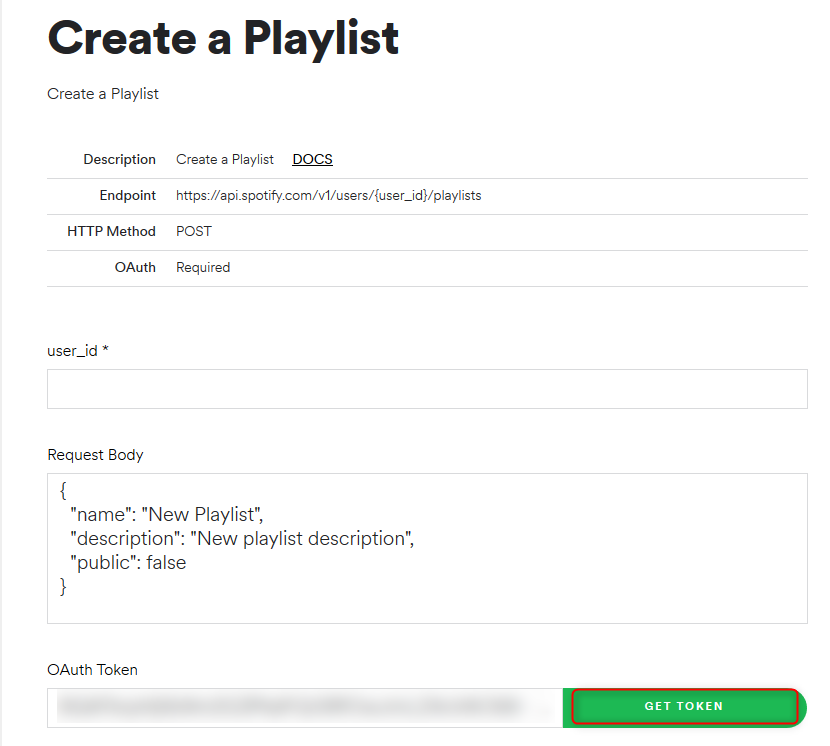
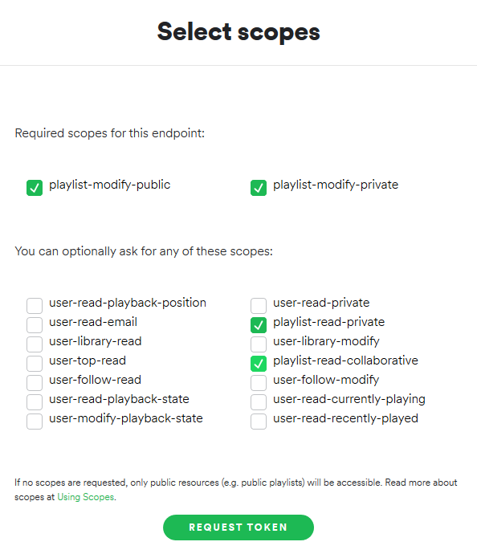

Just a simple script that generates or update a Spotify playlist based on the songs from any YouTube playlist. 
Inspired by the amazing tutorial from The Come Up (step-by-step [youtube video] and her [repo]) 

## Table of Contents
* [Details](#Details)
* [Technologies](#Requirements)
* [Setup](#Setup)

## Details
In addition to automatically creating a new spotify playlist, I've added the following features :
* enter the name of the youtube playlist to fetch the songs from
* enter the name of the new spotify playlist that will be created or the name of an existing one
* update an existing spotify playlist
* since I listen to korean songs, you can sometimes find the song name or artist in both korean and english, but in Spotify they are often listed in english so there is another script to delete any unecessary characters from the song title or artist.

This small and fun project was an opportunity to manipulate Youtube Data API and Spotify Web API for the first time.

## Technologies 
* [Youtube Data API]
* [Spotify Web API]
* [Requests Library]
* [Youtube_dl]

## Local setup

1) Install all dependencies
`pip install -r requirements.txt`

2) Collect your Spotify User ID and Oauth Token from Spotfiy and add it to secrets.py file.

    * To collect your User ID, log into Spotify then go here: [Account Overview] and its your **Username**
    * To collect your OAuth Token, visit this url here: [Get Oauth] and click the **Get Token** button.  
    Then select the four scopes (more details about [scopes]):
        * playlist-modify-public
        * playlist-modify-private
        * playlist-read-private
        * playlist-read-collaborative
      
    *Note: Spotify OAuth token expires very quickly, if you come across a `KeyError` this could be caused by an expired token. So just generate a new token!*

    

3) Enable Oauth for Youtube and download the JSON file that contains your OAuth 2.0 credentials. Save it as **client_secret.json**   
    * Just follow **Step 1** and **Step 3** to [set up Youtube OAuth].
    If you are having issues check this out [Oauth Setup 2] and this one too [Oauth Setup 3] 

4) Run the file  
`python3 playlist.py arg[1] arg[2] arg[3]` 
    * arg[1] -- the name of the spotify playlist you want to create/update
    * arg[2] -- the name of the youtube playlist to fetch the songs from
    * arg[3] -- "create" or "update"
    
    **Warning: it is case sensitive and names shouldn't have spaces**  
    For example `python playlist.py yt-discoveries Music create`

    * You'll immediately see `Please visit this URL to authorize this application: <some long url>`
    * Click on it and log into your Google Account to collect the `authorization code`.  
    *Note: the app will be subject to the unverified app screen since it is for personal use (more info [here](https://support.google.com/cloud/answer/9110914?hl=en))*

[youtube video]: <https://www.youtube.com/watch?v=7J_qcttfnJA&list=PLDMofWPjzlfmjVMPESb7-qw-28bI3zx3p&index=8&t=2s>
[repo]: <https://github.com/TheComeUpCode/SpotifyGeneratePlaylist#Video>

[Youtube Data API]: <https://developers.google.com/youtube/v3>
[Spotify Web API]: <https://developer.spotify.com/documentation/web-api/>
[Requests Library]: <https://requests.readthedocs.io/en/master/>
[Youtube_dl]: <https://github.com/ytdl-org/youtube-dl/>

[Account Overview]: <https://www.spotify.com/us/account/overview/>
[Get Oauth]: <https://developer.spotify.com/console/post-playlists/>
[Scopes]: <https://developer.spotify.com/documentation/general/guides/scopes/>
[Set Up Youtube Oauth]: <https://developers.google.com/youtube/v3/quickstart/python/>
[Oauth Setup 2]:<https://stackoverflow.com/questions/11485271/google-oauth-2-authorization-error-redirect-uri-mismatch/>
[Oauth Setup 3]:<https://github.com/googleapis/google-api-python-client/blob/master/docs/client-secrets.md/>
